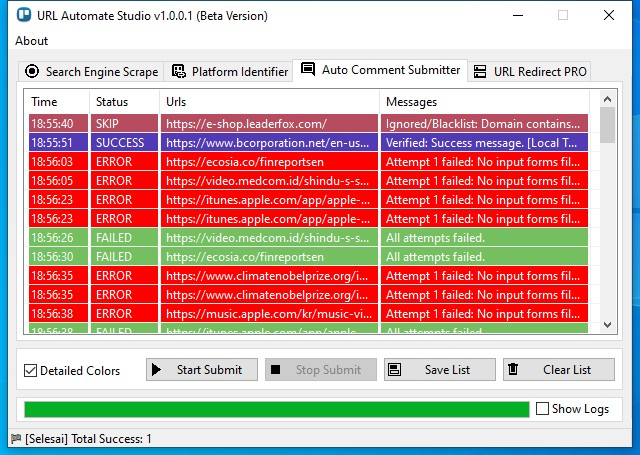
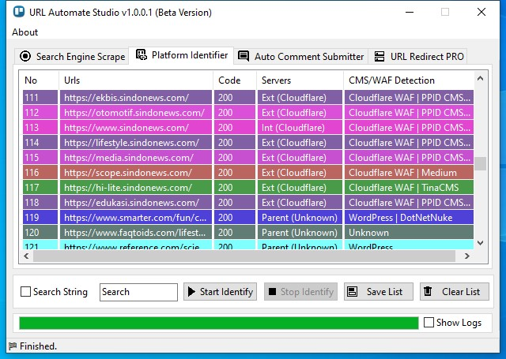
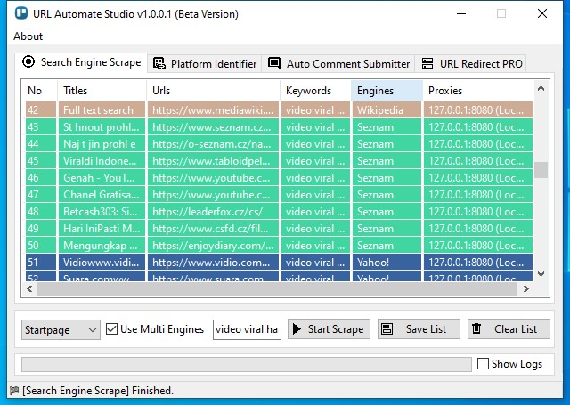
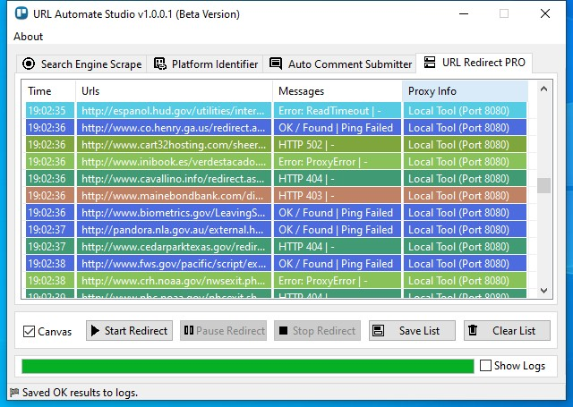

---

# **URL Automate Studio**

Automated SEO, URL Scraping, Platform Identification & Auto Commenting Toolkit
© 2025 – teknoxpert

---

## **📌 Tentang URL Automate Studio**

**URL Automate Studio** adalah software otomatisasi berbasis Windows yang dirancang untuk membantu user melakukan berbagai proses penting seperti:

* ✔ *Search Engine Scraping*
* ✔ *Platform Detection / CMS – WAF Identifier*
* ✔ *Auto Comment Submitter*
* ✔ *URL Redirect Checker PRO*

Software ini cocok untuk kebutuhan SEO, Web Research, Digital Marketing, Automation Task, dan Web Analysis.

> **Catatan Penting:**
> URL Automate Studio **hanya mendukung sistem operasi Windows 64-bit** (x64).
> Versi 32-bit (x86) tidak didukung karena aplikasi memerlukan pustaka dan modul otomatisasi yang memanfaatkan arsitektur 64-bit untuk performa optimal.

---

# **📸 Screenshot Tampilan Aplikasi**

---

## **1. Auto Comment Submitter**

<div align="center">
  
</div>

## **2. Platform Identifier**

<div align="center">
  
</div>

---

## **3. Search Engine Scrape**

<div align="center">
  
</div>

---

## **4. URL Redirect PRO**

<div align="center">
  
</div>

---

# **✨ Fitur Utama**

### 🔍 **1. Search Engine Scrape**

* Mendukung multi–search engine.
* Mendukung proxy lokal & external.
* Output otomatis ke log.

### 🧩 **2. Platform Identifier**

* Deteksi CMS (WordPress, Joomla, Drupal, dll.)
* Deteksi WAF (Cloudflare, Sucuri, dsb.)
* Menampilkan HTTP Code, Server, CMS/WAF.

### 💬 **3. Auto Comment Submitter**

* Submit komentar otomatis ke banyak URL.
* Menggunakan data acak dari *assets_message*, *firstname*, *lastname*, dll.
* Mendukung retry & error handler.

### 🔁 **4. URL Redirect PRO**

* Cek redirect chain, HTTP status, timeout, proxy.
* Log detail dari setiap proses redirect.

---

# **📂 Struktur File & Folder**

Di dalam direktori aplikasi, terdapat berbagai file pendukung:

```
URL Automate Studio.exe
├── assets_email.txt              ← user editable
├── assets_firstname.txt          ← user editable
├── assets_lastname.txt           ← user editable
├── assets_location.txt           ← user editable
├── assets_message.txt            ← user editable
├── assets_password.txt           ← user editable
├── assets_phone.txt              ← user editable
├── assets_urlredirect.txt        ← NOT recommended to edit
├── assets_useragents.txt         ← user editable
├── assets_website.txt            ← user editable
│
├── locales_keyword.txt           ← user editable
├── locales_proxies.txt           ← user editable
│
├── logs\                         ← semua hasil proses tersimpan di sini
├── runtime\                      ← DON'T edit
│
├── _AutoCommentSubmitter.py      ← DON'T edit
├── _PlatformIdentifier.py        ← DON'T edit
├── _SearchEngineScrape.py        ← DON'T edit
└── _UrlRedirectPro.py            ← DON'T edit
```

---

# **📝 Penjelasan Setiap File**

## **🔧 File Aset (Boleh di Edit oleh User)**

| Nama File               | Fungsi                                                |
| ----------------------- | ----------------------------------------------------- |
| `assets_email.txt`      | Daftar email acak untuk keperluan submit.             |
| `assets_firstname.txt`  | Nama depan acak.                                      |
| `assets_lastname.txt`   | Nama belakang acak.                                   |
| `assets_location.txt`   | Lokasi/wilayah acak.                                  |
| `assets_message.txt`    | Pesan komentar / text auto submit.                    |
| `assets_password.txt`   | Password acak (jika dibutuhkan form register/submit). |
| `assets_phone.txt`      | Nomor telepon acak.                                   |
| `assets_useragents.txt` | Daftar User-Agent untuk scraping.                     |
| `assets_website.txt`    | Daftar website sumber.                                |
| `locales_keyword.txt`   | Keyword untuk Search Engine Scrape.                   |
| `locales_proxies.txt`   | Daftar proxy HTTP/HTTPS/SOCKS.                        |

---

## **❌ File yang Tidak Disarankan untuk Diedit**

| File                       | Deskripsi                 |
| -------------------------- | ------------------------- |
| `assets/_urlredirect.txt`   | Core URL redirect module. |
| `_AutoCommentSubmitter.py` | Script internal.          |
| `_PlatformIdentifier.py`   | Script internal.          |
| `_SearchEngineScrape.py`   | Script internal.          |
| `_UrlRedirectPro.py`       | Script internal.          |
| `runtime/`                 | Berisi komponen runtime.  |

---

## **📁 Folder Log**

Semua output dari fitur-fitur aplikasi otomatis tersimpan ke folder:

```
logs\
```

Termasuk:

* Log scraping
* Log comment submit
* Log platform detection
* Log redirect

---

# **🚀 Cara Penggunaan**

## **1. Search Engine Scrape**

1. Masukkan keyword di `locales/_keyword.txt`
2. Klik **Start Scrape**
3. Lihat hasil di panel atau folder `logs/`

---

## **2. Platform Identifier**

1. Import list URL
2. Klik **Start Identify**
3. Software akan menampilkan CMS, Server, WAF, dll.

---

## **3. Auto Comment Submitter**

1. Isi data-data pada file:

   * `assets_message.txt`
   * `assets_firstname.txt`
   * `assets_lastname.txt`
   * dll.
2. Klik **Start Submit**

---

## **4. URL Redirect PRO**

1. Input URL list
2. Klik **Start Redirect**
3. Hasil akan tampil + tersimpan otomatis di `logs/`

---

# **⚠️ Disclaimer**

Software ini hanya untuk keperluan:

* Research
* Testing
* Development
* SEO Audit

Segala penyalahgunaan berada di luar tanggung jawab pengembang.

---

# **📜 License**

MIT License
Bebas digunakan untuk personal & commercial use.

---

# **📧 Contact Developer**

Untuk custom build / fitur tambahan:
**teknoxpert**

---
